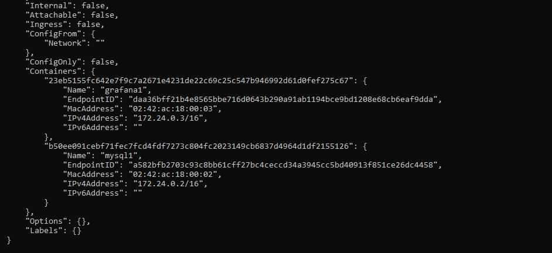
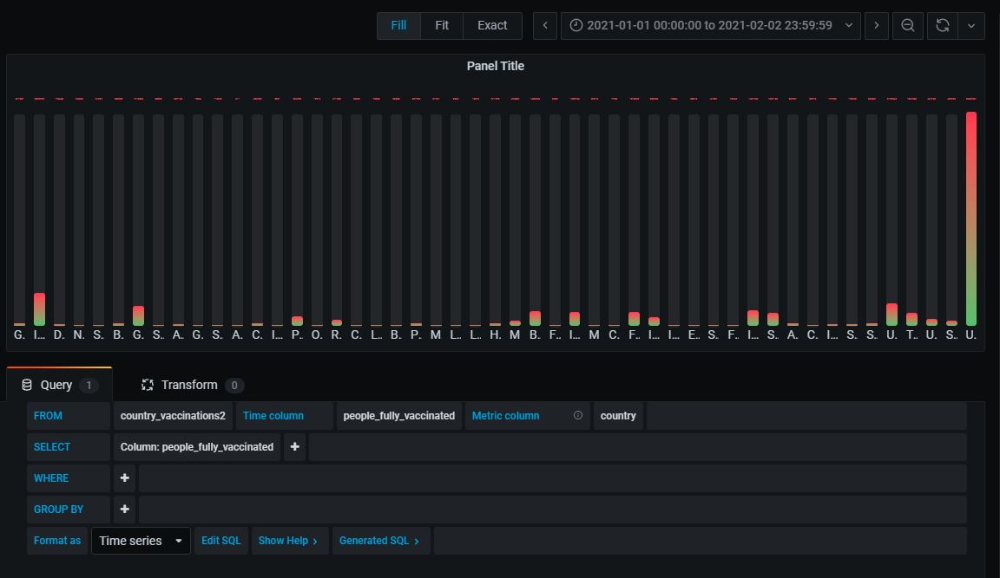
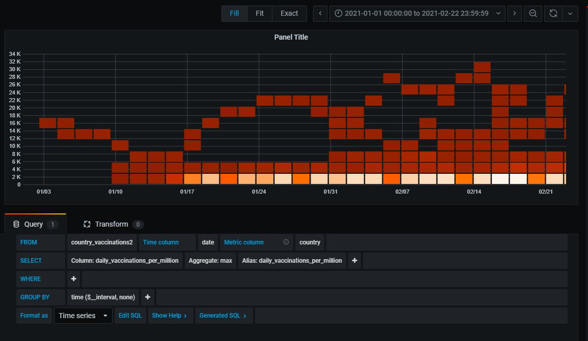
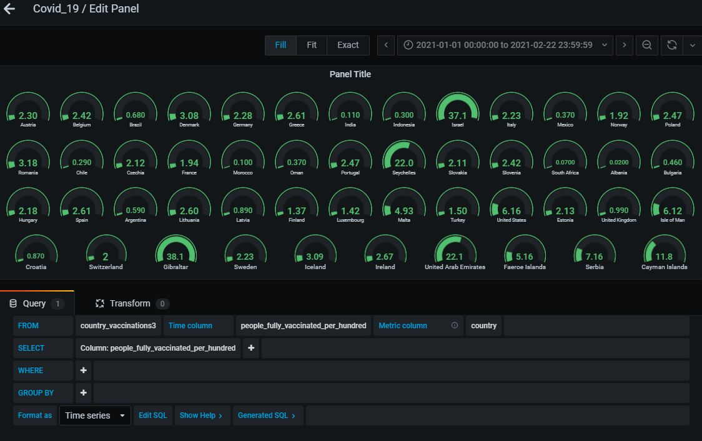
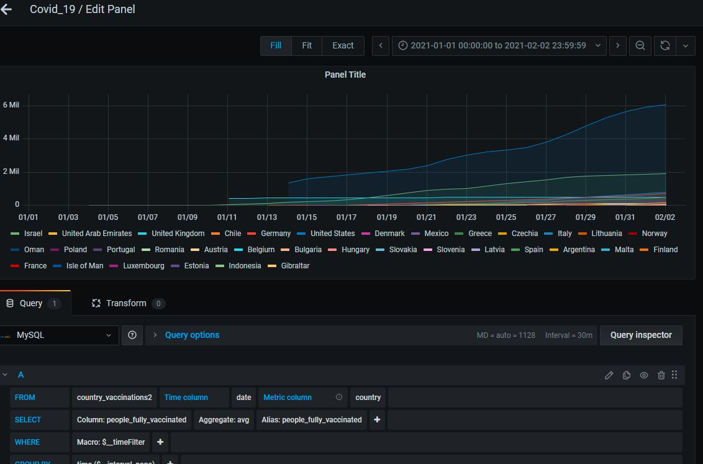
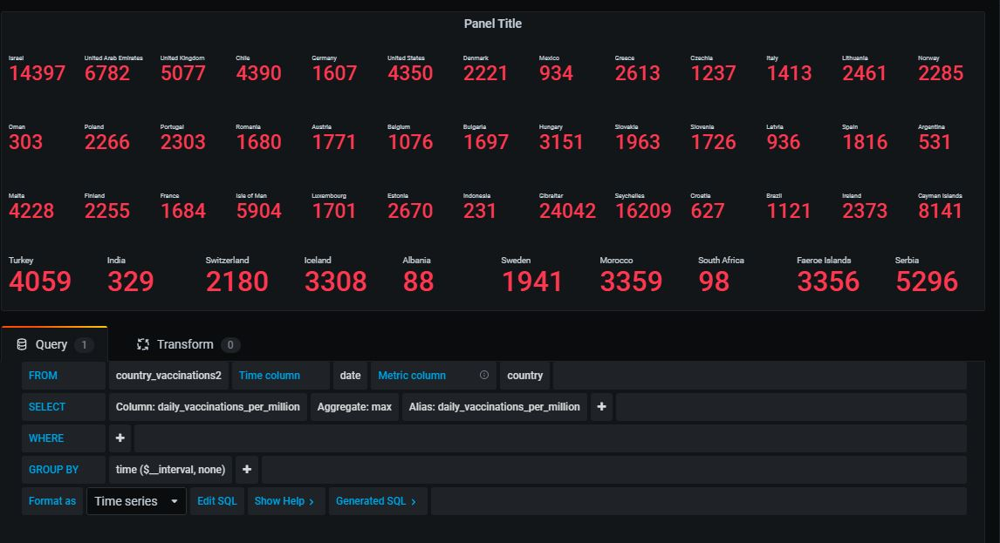

# Docker_Grafana_Covid

## Création du réseau(network)

Créez un réseau nommé mynetwork1 : docker network create mynetwork1

## Création des conteneurs

Créez le container mysql : docker run --net mynetwork1 --name mysql1 -p 3306:3306 -e
 MYSQL_ROOT_PASSWORD=password -d mysql:5.7 

Créez le container grafana : docker run --net mynetwork1 --name grafana1 -p 3000:3000 grafana/grafana:latest

## Inspection du réseau

Inspectez le réseau : docker network inspect mynetwork1

## Connection entre MySQL et Grafana

Notez l'adresse Ip des conteneurs ,notamment celui de mysql1 

Dans notre exemple, l’adresse Ip de mysql1 est 172.24.0.2 et le port est 3306. 
Lors de l’ajout de la base de données avec Grafana , il faudra noter 172.24.0.2:3306 dans la partie HOST . 

## Graphiques

### Voir tous les conteneurs actifs:
docker ps

### Travailler sur le conteneur mysql en bash:
docker exec -it data1_db_1 bash

### Se connecter à la base de données:
mysql -u user -ppassword

### Afficher les bases de données créés : 
show databases

### Quelques requêtes:
SELECT max(people_vaccinated)
FROM `db`.`country_vaccinations2`;

# Création de la base de données avec Docker-compose et mysql

## docker-compose.yml 

<blockquote>
version: '3.3'
services:
  db:
    image: mysql:5.7
    restart: always
    environment:
      MYSQL_DATABASE: 'db'
      # So you don't have to use root, but you can if you like
      MYSQL_USER: 'user'
      # You can use whatever password you like
      MYSQL_PASSWORD: 'password'
      # Password for root access
      MYSQL_ROOT_PASSWORD: 'password'
    ports:
      # <Port exposed> : < MySQL Port running inside container>
      - '3306:3306'
    expose:
      # Opens port 3306 on the container
      - '3306'
      # Where our data will be persisted
    volumes:
      - my-db:/var/lib/mysql
# Names our volume
volumes:
  my-db:
</blockquote>
  
  
  
